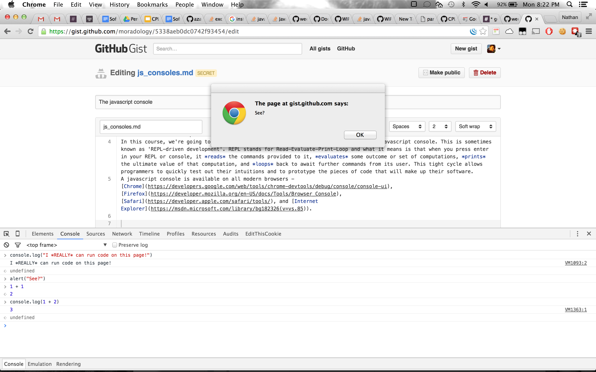

# Playing with Javascript

#### REPL-Driven Development
In this course, we're going to encourage heavy and consistent experimentation inside a javascript console. This is sometimes known as 'REPL-driven development'. REPL stands for Read-Evaluate-Print-Loop and what it means is that when you press enter in your REPL or console, it *reads* the commands provided to it, *evaluates* some outcome or set of computations, *prints* the ultimate value of that computation, and *loops* back to await further commands from its user. This tight cycle allows programmers to quickly test out their intuitions and to prototype the pieces of code that will make up their software.  
A javascript console is available on all modern browsers - [Chrome](https://developers.google.com/web/tools/chrome-devtools/debug/console/console-ui), [Firefox](https://developer.mozilla.org/en-US/docs/Tools/Browser_Console), [Safari](https://developer.apple.com/safari/tools/), and [Internet Explorer](https://developer.microsoft.com/en-us/microsoft-edge/platform/documentation/f12-devtools-guide/) (your teachers use Chrome and like Firefox - we encourage you to try one these browsers).  

